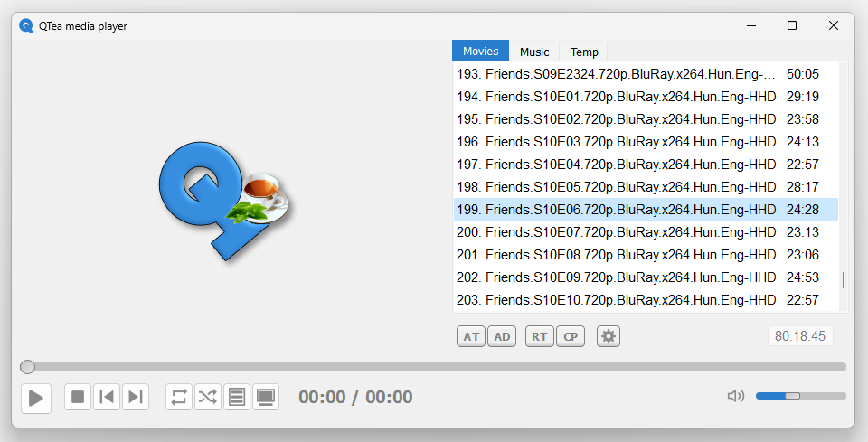
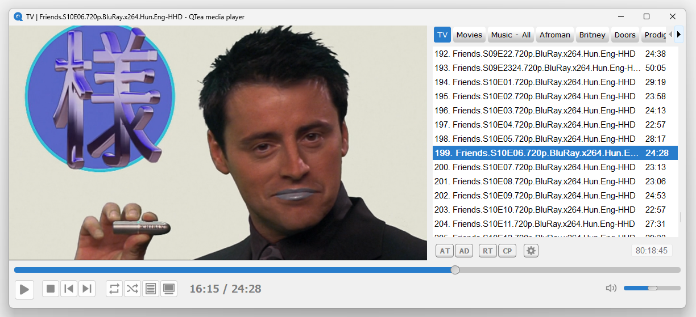
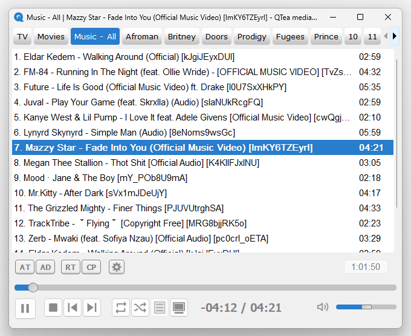
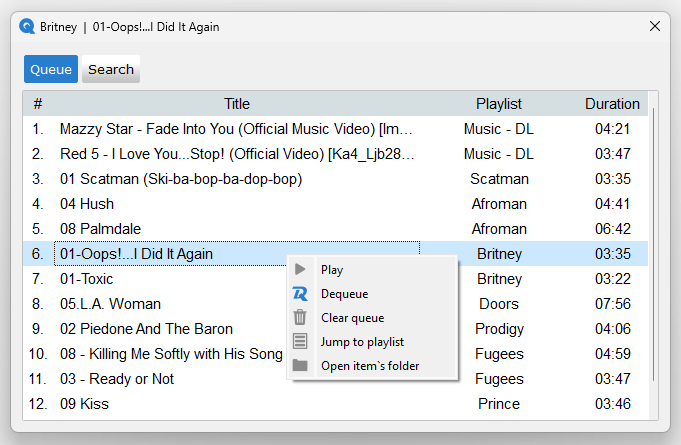
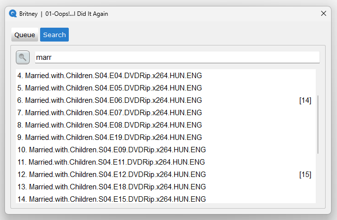
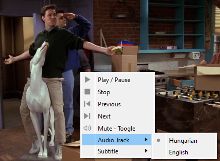
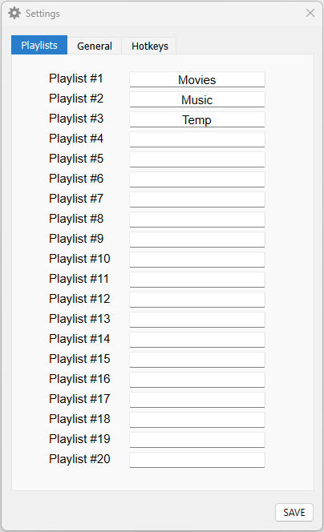
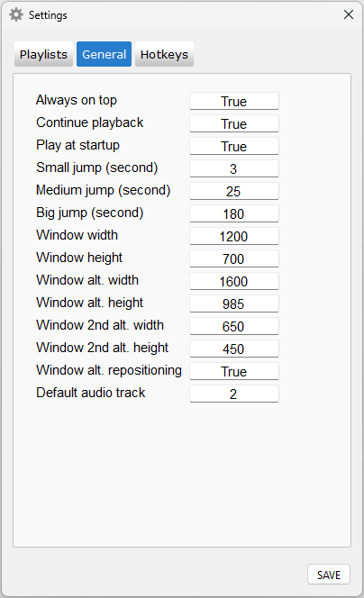
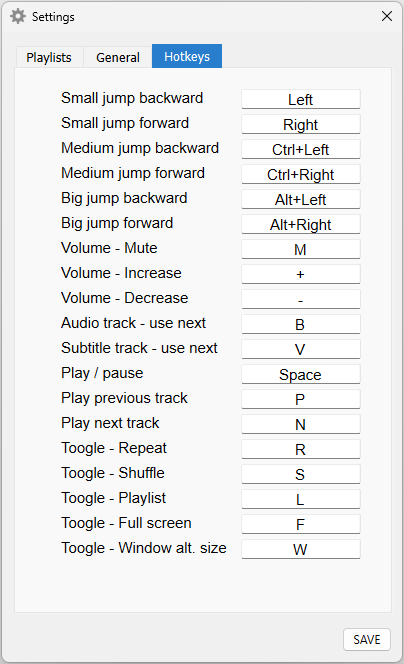

## Main features
- Thirty playlists supported by default. More can be generated.
- Cross playlists queue management with dedicated window.
- Cross playlists search.
- Drag & drop - files, folders.
- Start media from the latest point.
- Start the last played media at startup.
- Quick switch to alternative window mode / size / position.
- Playlists saved by default.
- Set video's preferred audio track to default.
- QTea media player can be a viable option for highly organised contentgoers and house party DJs. Inspired by `Winamp` and `VLC media player`.

<div align="left">
    
</div>
<br>
<div align="left">
    
</div>
<br>
<div align="left">
    
</div>
<br>
<div align="left">
    
</div>
<br>
<div align="left">
    
</div>
<br>
<div align="left">
    
</div>
<br>

## Terminology
- `Playing playlist` = playlist where the current track is in the playing or paused state / playlist where the last track was played.
- `Active playlist` = playlist which is currently selected / displayed.

## Play buttons
- The `Play`, `Stop`, `Previous track`, `Next track` and `Shuffle` buttons behave as usual
- The `Repeat playlist` button has 3 states:
    - Disabled
    - Repeat playlist - the button is flat.
    - Repeat currently playing track - the button is flat and a square shape displayed in the middle of the icon.
- `Toggle Video and Playlist` buttons show/hide the video or playlist section.
    - Can not hide both the same time.
    - At startup both the video and playlist section are visible as default.
- Tooltip is displayed when the mouse moved over the current button.

## Playlist buttons (under playlists section)
- `AT - Add Track`: add a single media/file to the playlist.
- `AD - Add Directory`: adding all the media files listed in the selected directory and subdirectories.
- `RT - Remove Track`: removes the current/selected track.
- `CP - Clear Playlist`: removes all the items from the current playlist.
- `Settings button`: opens the `Settings window`.
- Tooltip is displayed when the mouse moved over the current button.

## Settings window
- To open the `Setting window` click on the `Cog/Settings icon` under the playlists section. 
- `Playlists tab:`Able to update the playlists titles - hide/show the playlists.
- `General tab:` Adjust the shortcut keyboard values.
- `Hotkeys tab:` Adjust the player's jump values.
- Saving the `Settings window` values by clicking on the `Save button`:
    - Saves all the values from all the tabs if there is no invalid value.
    - Else: 
        - Pop-up window displayed with the error message for all the invalid scenarios.
        - Error message includes the name of the field with the invalid value and the rule it should follow.
        - The pop-up window title: ERROR - TAB'S NAME (where the invalid value occurred).

### General
- `Always on top`: Keeps the player on top of other currently running applications
- `Continue playback`:
    - Saves the duration of the currently playing track every 5 seconds
    - When revisiting the same track, the play continuous from the latest, saved position
- `Play at startup`:
    - Automatically plays the last played track at startup
    - If the track was removed while playing, at the next startup it plays the track in the same row
    - If the last play track removed and there is no track in the same row:
        - If the playlist is not empty: It plays the first track of the playlist
        - If the playlist is empty: No track played
- `Small / Medium / Big jump`: 
    - Seconds the player position will be moved (forward/backward)
    - Hotkeys of the direction/jump type are in the `Hotkeys tab`
- `Window width-height / alt. / 2nd alt.`:
    - Values of the different window sizes
    - To switch between the different window sizes, use the `Window alt. size` hotkey (`Hotkeys tab`)
    - `Window width-height`:
        - The size of the window at startup or the window size toggle hotkey pressed thrice
        - Both video and playlist section/window are visible
    - `Window alt. width-height`: 
        - The size of the window after the window size toggle hotkey pressed once
        - Only the video window is visible, the playlist window is hidden
    - `Window 2nd alt. width-height`: 
        - The size of the window after the window size toggle hotkey pressed twice
        - Only the video window is visible, the playlist window is hidden
    - `Window alt. repositioning`:
        - Repositioning the window depending on the selected size
        - Default and 1st: middle of the screen / 2nd: right, bottom corner of the screen
    - `Default audio track`:
        - Video starts with the selected audio track
        - Can be useful while watching multiple episodes of a tv show in one sitting where the preferred audio track is not the first/default one
    - Ideas:
        - Use the first alt. window size when the user is close to a wide screen (e.g.: having a lunch)
        - Use the second alt. window size when player is secondary for you and it is placed in the right, bottom corner of the screen (e.g.: browsing)
        - Adjust the sizes according the currently played TV show`s video ratio to avoid black bars  

### Hotkeys
- Acceptable hotkey formats: `M`, `m`, `Ctrl`, `ctRL`, `M+Ctrl`, `M+Ctrl+Space`
- Acceptable hotkey list in `src / cons_and_vars.py / keys_list`
- `Small / Medium / Big jump - backward/forward`:
    - The values of the jump types are defined in the `General tab`.
- `Play\pause` vs `Play`:
    - `Play\pause`:
        - If a track is in the playing/paused state: pauses or continues to play the track independently from the current active playlist
        - If no track is in the playing/paused state: starts the selected track on the active playlist
    - `Play`: starts the selected track on the active playlist even if there is a track in the playing/paused state from any playlist
- `Volume - Increase / Decrease`: changes the volume with +/- 5%
- `Audio track - use next`: toggles between the available audio channels, there is no disabled state
- `Subtitle track - use next`: toggles between the available subtitles and a disabled state
- `Toggle - Full screen`: next to the value set up in this field the `Escape` button is hard-coded to quit from the full screen mode
- `Toogle - Window alt. size`:
    - Toggles between the default / alt. / 2nd alt. window sizes defined in the `General tab`
    - Default: both video and playlist sections are visible
    - Alt. and 2nd alt.: only the video section is visible 
- `Playlist - Select previous / next`: jumps between the playlists available
- `Queue / Dequeue track`:
    - Add track to / removes track from the queue list.
    - This hotkey takes action on the `Active playlist`.
    - On the `Queue and Search window`s track list the right-click / Queue-Dequeue should be used
- The rest of the hotkeys are self-explanatory.

### Playlists
- In the `Settings window / Playlists` tab all playlists are listed.
    - To make a playlist visible:
        - Add a title to the playlist.
        - If the playlist is used the first time: empty playlist will be displayed after restart.
        - If playlist had tracks before it was hidden: the records will be loaded automatically after restart.
    - To hide a playlist:
        - Remove the title of the playlist.
        - At least one of the playlists remains visible:
            - Not able to remove all the playlist titles: clicking on the `Save button`: pop-up window will be displayed with the error message.
        - The hidden playlist's records/media information remains in the database.
- Able to add/remove tracks to any of playlists: the playlist is saved automatically
    - At startup:
        - All playlists loading automatically.
        - On all playlist the last played track is selected.
        - The `Playing playlist` is active/displayed.
<br>
<div align="left">
    
    
    
</div>

## Active and Playing playlists separation
- All the below steps actioned on the `Playing playlist` even if the active and playing playists are different:
    - Paused --> Play
    - Play previous track
    - Play next track
    - Play next track in the playlist automatically after end of the current track
    - Shuffle / repeat functionalities
    - All hotkey functionalities: change audio/subtitle track
- Window title = Playing playlist title | Track title

## Steps to increase the number of playlists beyond the default / to generate new playlist database
1. Close the app if it is running.
2. Rename the current playlist database: `playlist.db`.
3. In the `src / cons_and_vars.py` file change the `playlist_amount = 30` value to as many playlists you wish, save the file.
4. In the `src / tables_and_playlists_guide.py` run the `create_tables()` function -> New `playlist.db` will be created.
5. After the next start of the app, all the playlists will be visible with increasing numeric titles.
6. Optional: Change the title of the playlists via the `Settings window / Playlists`.
7. Optional: Remove the previous playlist database.

## Other Behavior
- `Volume`
    - Changing the volume after the app is muted:
        - It switches back to the un-muted state.
        - New volume = volume before muted -/+ the change.
    - The volume range is less wide compared to `VLC media player`.
- `Screen saver`
    - When video window is displayed and video is playing the screen saver is turned off.
        - Otherwise the screen saver is on as usual.
- `Drag & Drop`
    - Internal: able to relocate/move a playlist item.
    - External: selected files and/or folders can be grabbed and dropped on the active playlist from File Explorer, Desktop, .. . 

## File types
- Currently available: *.mp3 *.wav *.flac *.midi *.aac *.mp4 *.avi *.mkv *.mov *.flv *.wmv *.mpg
- Not all the listed file types are tested.
- To update to the file types lists, please see the `src / cons_and_vars.py / FILE TYPES` section.
    - `FILE_TYPES_LIST` used to sort the files in the file dialog window - `AT - Add Track` button.
    - `MEDIA_FILES`'s listed file types used to select the correct files from the selected dictionary and subdirectories - `AD - Add Directory` button.

## Workarounds
### Dummy track
- Issue: the first track has to be played from the start till the end before be able to switch to another track
- Solution: dummy, empty track (< 1 second) played at startup
- More info: `src / av_player.py`
- Side-effect:
    - no visible side-effect
    - unlikely adding much to the launch time: 1.2 seconds on my rig

### Dummy playlist tab
- Issue: if the last playlist tab is hidden, the whole playlist tab list is not reachable via the arrow buttons 
- Solution: The last, dummy, disabled playlist tab always visible
    - More info: `src / playlists.py`
    - Side-effect: disabled, not clickable, small pice is visible on the right side of the playlists bar

### Information displayed as subtitle
- Issue: the video scene composition not following the layout, frame size change
    - Window <- QFrame <- Layout <- QGraphicsView <- QGraphicsScene <- QGraphicsVideoItem
- Solution: the information(track title, volume, ..) displayed as subtitle on the video screen when there is no active subtitle via QVideoWidget
    - Side-effect:
        - when a subtitle is active and a video is playing, the information is not displayed on the video screen
        - when the video is not playing, the information is not displayed on the video screen

### Duration slider's handle
- Issue: when the Windows' display scale is 150% or above, the duration slider's circle handle get truncated
    - Looks like the issue is not DPI dependent, same result with different resolutions
- Solution: if display scale is 150% or above -> square handle displayed which is not reaching over the groove -> no truncation

### Could not find solution yet
- Issue: the last frame of the previous video is displayed before a new video starts playing in the scenario: a video is playing --> stop the video or start playing a music track --> playing a new video
    - More info: `src / func_play_coll.py / play_track()`
- Issue: video`s full-screen surface always opens on/covers the primary screen, even when the app is on the secondary screen/display
- Issue: the video`s own subtitles are not displayed correctly, VLC player recommended for subbed movies


## Requirements
### Python 3 - used: 3.11.5
- https://www.python.org/

### Install dependencies
``` pip install -r requirements.txt ```

### OS
- Tested on Windows 11

## Thank you all who worked on the modules used in this project!
## Thank you all Winamp and VLC player contributors!